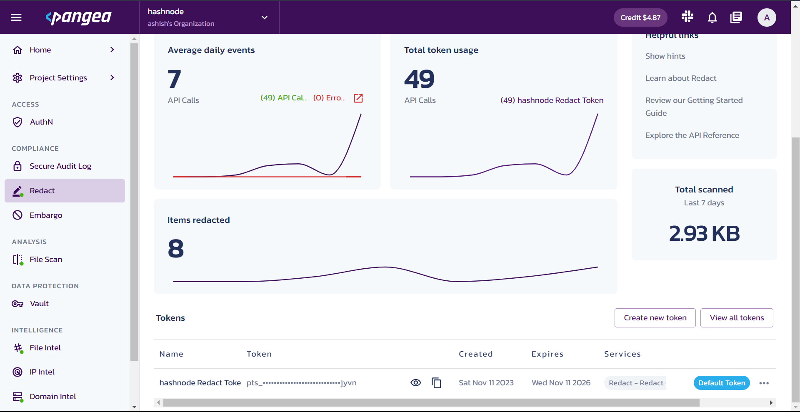

## Disguard
A simple Discord bot that keeps your server safe and secure. Built using [Pangea](https://pangea.cloud) & [Discord.py](https://github.com/Rapptz/discord.py) for the [Hashnode x Pangea Hackathon](https://hashnode.com/hackathons/pangea) by [Hashnode](https://hashnode.com).

## Stack
- [Pangea](https://pangea.cloud)
- [Discord.py](https://github.com/Rapptz/discord.py)
- [Supabase](https://supabase.com/)
- [Github](https://github.com)
- [Hashnode](https://hashnode.com)

## Features
- [x] **Auto Redact** - Automatically redacts messages that contain profanity/private information like emails, phone numbers, credit card numbers, etc.
- [x] **Auto URL Scan** - Automatically scans URLs present in messages for malicious content and deletes it if a malicious URL is found.
- [x] **Auto File Scan** - Automatically scans files uploaded to the server for malicious content and deletes it if a malicious file is found.
- [x] **Logging** - Logs reports of malicious content found in messages, URLs, and files to a channel in the server for you to review.

## Usage
1. Sign up for [Pangea](https://pangea.cloud) and enable **Redact**, **URL Intel**, and **File Scan**.


2. Get the API keys for each of the above mentioned services and add them to your `.env` file.
```env
REDACT_TOKEN=your_redact_token
FILESCAN_TOKEN=your_filescan_token
PANGEA_DOMAIN=your_pangea_domain
URLSCAN_TOKEN=your_urlscan_token
```

3. Head over to [Discord Developer Portal](https://discord.com/developers/applications) and create a new application. Then, create a bot for the application and copy the client token and client ID. Make sure you enable all the gateway intents for the bot. Add these to your `.env` file.
```env
BOT_TOKEN=your_bot_token
BOT_ID=your_bot_id
```

4. Create a new account on [Supabase](https://supabase.com/) and create a new project. Add the project URL and the public key to your `.env` file.
```env
SUPABASE_URL=your_supabase_url
SUPABASE_KEY=your_supabase_key
```

5. Create a new table `logger` in your Supabase project using this query in the SQL editor.
```sql
create table
  public.logger (
    id bigint generated by default as identity,
    created_at timestamp with time zone not null default now(),
    guild_id bigint not null,
    channel_id bigint null,
    constraint logger_pkey primary key (guild_id)
  ) tablespace pg_default;
```

6. Clone this repository and install the dependencies.
```bash
git clone https://github.com/asrvd/disguard.git
cd disguard
pip install -r requirements.txt
```

7. Run the bot.
```bash
python bot.py
```

## Resources
- [Pangea API Documentation](https://pangea.cloud/docs)
- [Discord.py Documentation](https://discordpy.readthedocs.io/en/stable/)
- [Supabase Documentation](https://supabase.com/docs)
